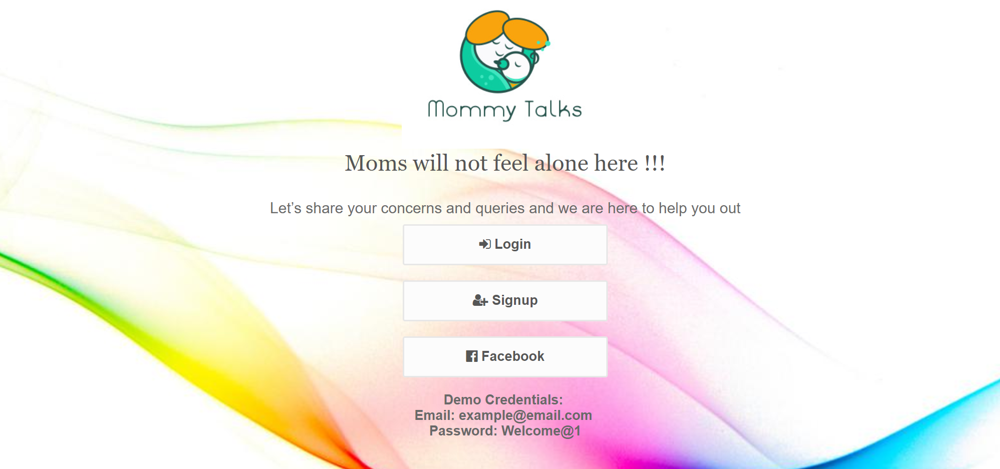
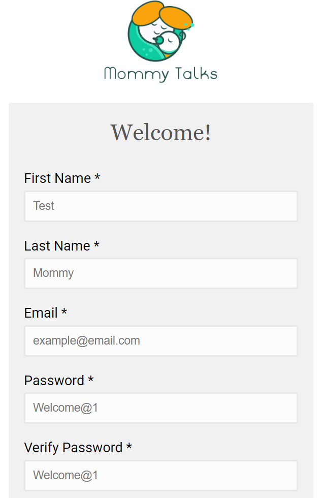
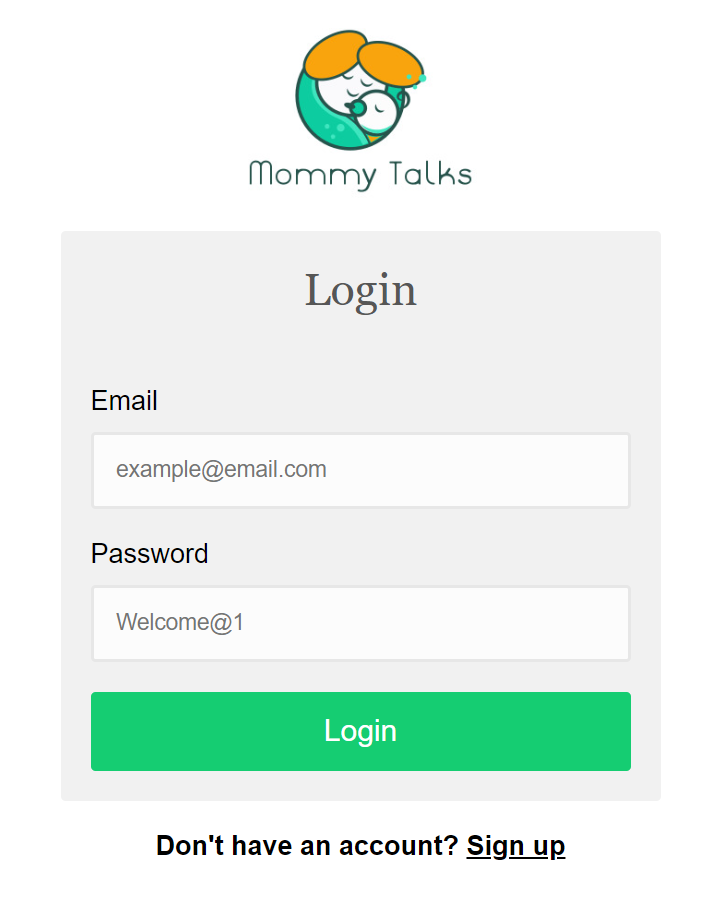
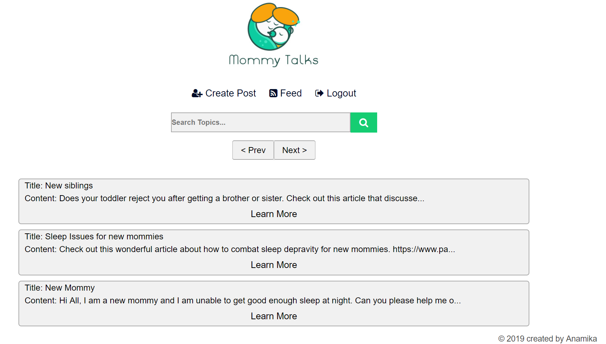
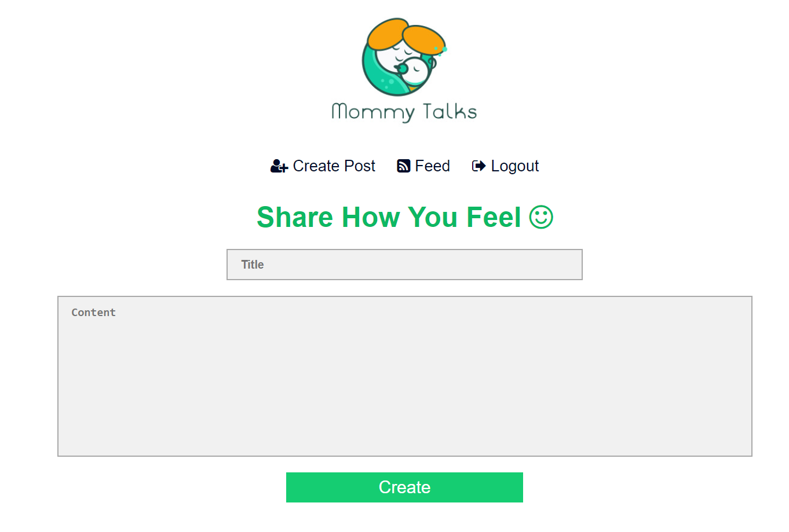
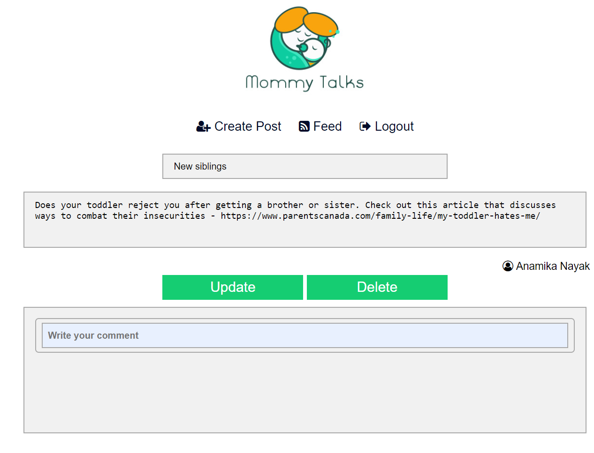
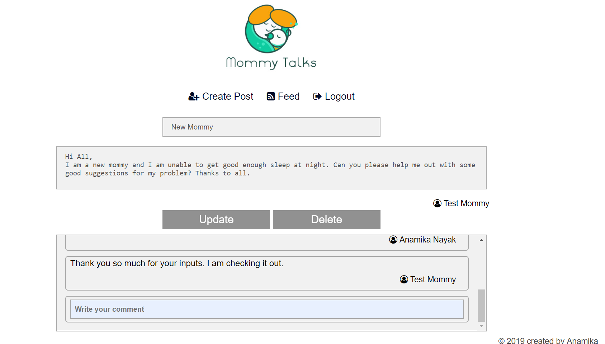

# Mommy Talks - App

A place for new, upcoming and experienced mothers to share their concern, get helpful suggestions etc.

## Background
Being a mother myself, and having experienced hardships bringing up my daughter, I always used to wonder if I could seek help from fellow mothers
regarding any concerns I was having that time.
Hence, I would like to present to you all a forum for mothers to share, discuss and debate all questions faced by mothers
around the world.

### Built With
   <ul>
     <li>node.js</li>
     <li>express.js</li>
     <li>mongodb</li>
     <li>jquery</li>
     <li>html</li>
     <li>css</li>
     <li>mocha</li>
     <li>chai</li>
     <li>mongoose</li>
   </ul>
   
## Description

Users in Mommy Talks, gets to share their experiences, ask new questions or get helpful suggestions in the form of new posts or comments to existing posts.
Users can also search for topics they are interested in and view their associated content.

### Usage

<ul>
  <li>Allow Users to register to the application using their e-mail and password</li>
  <li>Allow Users to post motherly questions, concerns or share information</li>
  <li>Allow Users to update/ edit their posts</li>
  <li>Allow Users to comment on their own posts as well as other user's posts</li>
</ul>

Open the app <a href="https://mommy-talks-app.herokuapp.com/" target="_blank">here</a>
You will see a page like this:

## Screenshots depicting user journey

You can login using the demo credentials mentioned in the home page
- Email: example@email.com 
- Password: Welcome@1

Or, if you would like to, please feel free to sign-up into the app using your email and secret password.
_We do not share any personal information with anyone else._

#### Sign-up page

Once you have signed-up successfully, you will be redirected to the Login Page, where you can enter your credentials to start using the app.
#### Login page 

Congratulations! Now that you are inside the app, you can search for topics you are interested in, create new posts or provide comments on existing posts. In the Home Page, you see list of all available posts.

#### Home Page

Clicking on 'Create Post' will let you create a new post.
#### Create Post Page

You can click on the 'Learn More' link to see any post's details
#### Post Details Page

If you are the author of this post, then you can update or delete the post as well.
_Remember, deleting the post will also delete all comments associated with it._

#### Comments section
The Update Post page also has comments section, for anyone to see existing comments or add new comments.

### Thank You
Please share your feedback to anamikaeight@gmail.com.